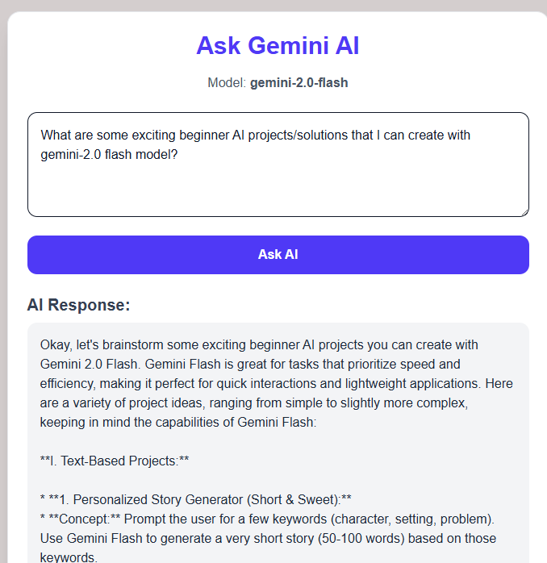

# 💬 Gemini AI Chatbot UI

This project is a simple but powerful web-based chatbot that wraps Google's Generative AI SDK on top of Next.js, allowing users to interact with the **Gemini 2.0 Flash** model in real-time through a clean, responsive user interface.


## 🚀 Features

- User-friendly React frontend with dynamic question input
- Real-time interaction with Gemini AI (Google Generative AI SDK)
- Styled using Tailwind CSS for clean, modern UI
- Fully integrated with **Google Cloud Console** for API configuration and billing
- Supports Google's **$300 Free Trial Credit**

## 🧠 What I Learned

This project taught me how to:

- Set up and manage API credentials using the **Google Cloud Console**
- Enable the **Generative Language API**
- Understand API usage tracking and billing activity
- Handle async interactions and error states in React
- Design an engaging and responsive UI with Tailwind CSS

## 💡 Motivation

Google’s $300 Free Trial Credit made this the perfect opportunity to explore LLMs in a low-risk way. With this foundation, I plan to build more advanced AI-driven applications—ranging from personal assistants to domain-specific agents.

## 📷 Preview

Below is a screenshot of the chatbot UI in action:

 

---

## 🛠️ Technologies Used

- React / Next.js
- Tailwind CSS
- Google GenAI SDK (`@google/genai`)
- Google Cloud Platform (GCP)

## 📌 Getting Started

1. Clone the repo/
2. Get your API key from `https://console.cloud.google.com/welcome/new?inv=1&invt=AbxEJg&project=gen-lang-client-0323525482`
3. Set up your `.env.local` file with your Gemini API key:
`NEXT_PUBLIC_GEMINI_API_KEY=your_api_key_here`


Run the app:
```bash
npm install
npm run dev
```

## 🔮 Future Ideas

- Add Markdown rendering for AI responses
- Enable voice input and audio responses
- Chain of thought prompting
- Deploy on Vercel 
